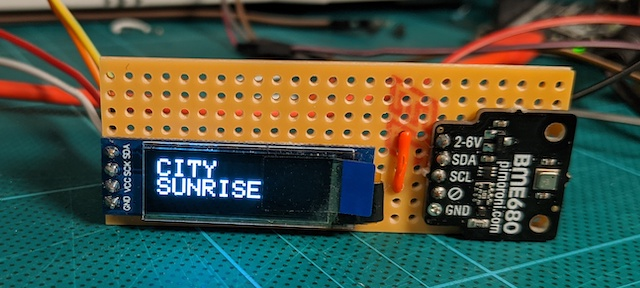

# City Sunrise

A project to create an ambient interface using LEDs to show various environmental data.

## Background

I wanted to create a light display as a site specific installation to fit over my window, which is five metres wide. I bought a rope of 300 addressable NeoPixel LEDs and started to think about what I could sense, what I would want to know and how I might want to see it displayed.

I was inspired by my memory of _Light Tower_ 1972-2016 by [Philip Vaughan](https://www.philipvaughan.net) which was mounted on the roof of the Hayward Gallery from 1972 to 2016. I fondly remember seeing the work daily when I was studying at King’s College and regularly walk over Waterloo Bridge.

We were already using the Adafruit Metro M0 in class and so I decided to use a weather related sensor for my project and settled on the BME680 from Pimoroni. It returns four reading which I was interested in temperature, humidity, air pressure and volatile organic compounds (VOC - a proxy measure for certain air pollution). I also bought a small OLED screen which I found was incredibly helpful for debugging purposes as well as a nice addition for information output. It was slightly tricky getting both the BME680 sensor and the OLED screen working since they used the same pins, but I found out it can use the I2C interface and that it has two address which can be switched by soldering closed a jumper switch on the back.

Once I had the sensor working I [logged](images/temperature by time.png) [some](images/pressure by time.png) [measurements](images/humidity by time.png) via the serial interface using a small NodeJS script. I was then able to get some idea of the range of values I could expect and the rates of change.

I wrote a bunch of test scenes for the LEDs and learned how to use VS code as an editor for Arduino code. I found it was much easier to simulate the sensor inputs using a variable resitor, and use that to cycle through the range of inputs and outputs. I used a button to switch between scenes. It was a challenge writing my code so that each scene could run and it would still return to the main loop in order to check for button pushes and get the value of the variable resistor. I split my code up in to different header files, I'm not sure it was the best solution as there are a lot of global variables, but it made the code more managable. If I had more time I would like to look at using C++ classes and especially creating a class which would easily allow me to do running/longer term averages of the sensor data so that I could show rates of change.

I learned that powering so many LEDs at maximum is a big technical challeng in its own right and that did cause some constraints on my ideas for how I could use the lights for output. I also would I have liked to use a board which has WiFi as then I could connect to internet APIs to get weather data and predictions, however this was more complex still both for coding and also as the boards seemed to only output 3.3v and I needed 5v.

Overall I'm really happy with the outcome and I would really like to continue to work on it and perhaps overcome some of the limitations I reached.

* [Fritzing diagram of circuit](images/city-sunrise_v1.png) (later I changed to use a rotator switch which I was unable to find in Fritzing so I still show the variable resistor)
* [Video of City Sunrise in situ](https://youtu.be/tv7C-W1Er1U)

## Parts list

- Adafruit Metro M0
- Adafruit BME680 Sensor - temperature, humidity, air pressure, VOC
- SSD1306 Monochrome OLED screen, 128x32 pixels
- WS2811 "NeoPixel" rope 300 pixels
- HW-040 Rotary encoder and switch
- 1000µF 6.3V capacitor
- 5V 2A DC power supply

## Libraries

- FastLED - https://github.com/FastLED/FastLED
- TFT - https://www.arduino.cc/en/Reference/TFTLibrary
- Adafruit BME680  - https://github.com/adafruit/Adafruit_BME680
- Adafruit SSD1306 - https://github.com/adafruit/Adafruit_SSD1306

## Notes

- Powering neopixels using levelshifter for 3.3 -> 5v https://learn.adafruit.com/neopixel-levelshifter
